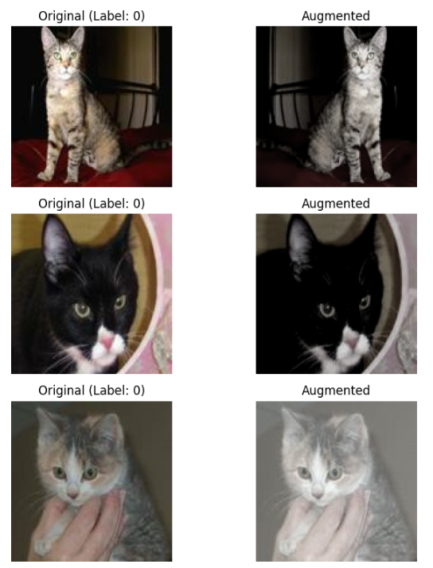
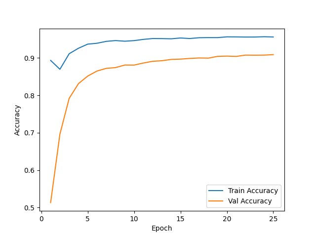
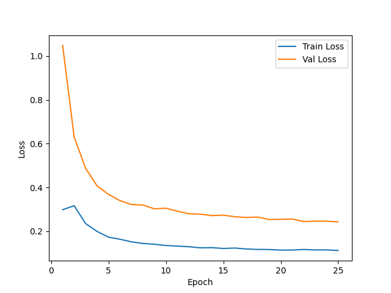
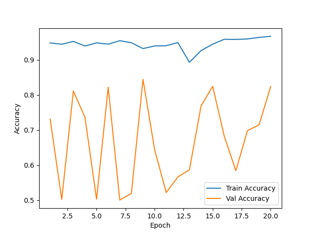
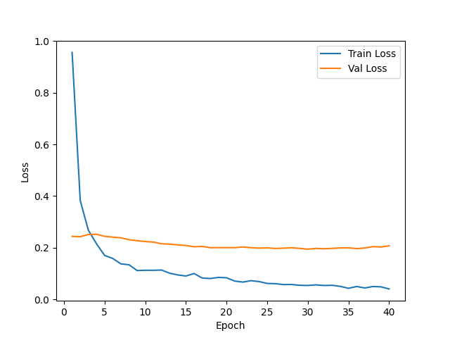
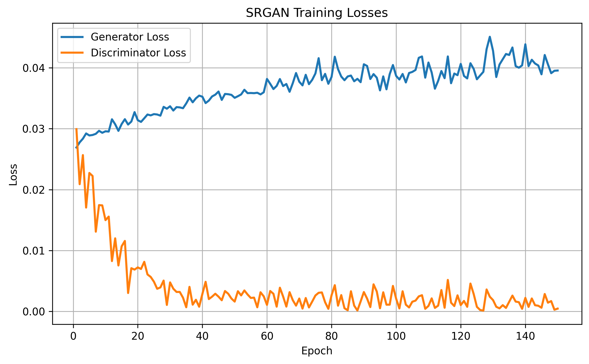
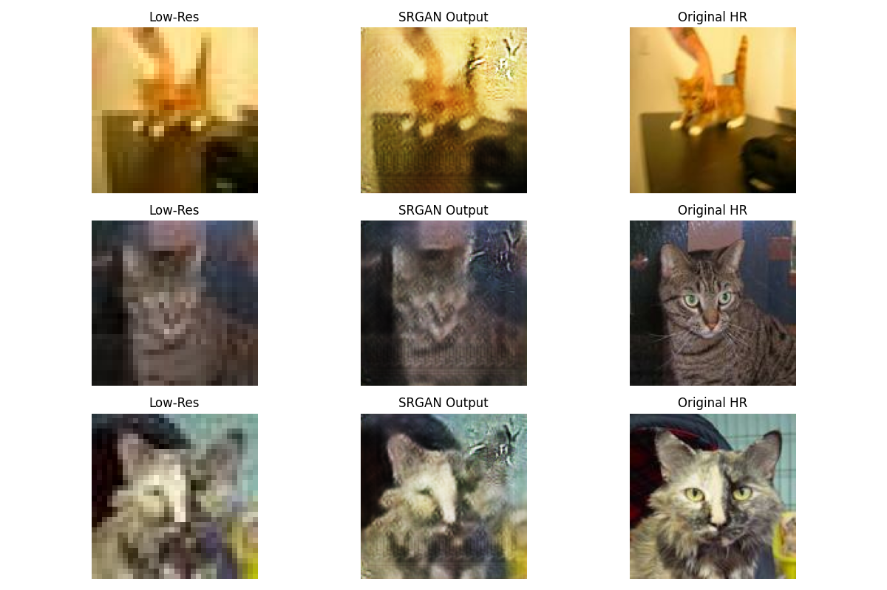

# SRGAN - LH

### Data Structures

**data**  
├── **train_32/**  
├── **train_128/**  
├── **train_128_from_32/**  
├── **test_32/**  
├── **test_128/**  
└── *data_preparation.py*  

**notebooks**  
└── *GAN2.ipynb*  

**models**  
├── *modelA.keras*  
├── *modelB.keras*  
└── **modelSRGAN/**  
&emsp;├── *srgan_generator_epoch150.keras*  
&emsp;├── *srgan_discriminator_epoch150.keras*  
&emsp;├── *srgan_losses.csv*  
&emsp;└── ...  

##### Tiny info
Data Files on GitHub hold limited image files to due size restrictions.   
The number represents the resolutions (32 is 32x32 res, 128 is 128x128, and 128_from_32 is the 128x128 made from the 32x32 using the SRGAN).   
Data splitting was done via data_preparation.py. 16800 Training & 7200 Testing --> 70/30 Split.   
Half of training set and half of testing set are images of dogs. Other half are images of cats. (Reference 6)      
Trained on Google Colab A100

### Description of the SRGAN
Three parts to the SRGAN:     
- The first is the CNN (made earlier in the semester) which classifies cats and dogs (Model A)   
- The second is the SRGAN which pulls the same training images (downsized to 32x32) and recreates them as (128x128) images   
- Then, the third is an almost exact copy of the the first model, but instead, it uses the photos created by the SRGAN to train (model B)    

### The *GAN2.ipynb* file is split into 5 sections
- Resetting up the data, libraries, directories, initialization
--- check here
- Model A (Binary Classifier)
- SRGAN (Generator & Discriminator)
- Make and save the training data for Model B from SRGAN
- Model B (Binary Classifier via upsized training data from SRGAN)

### Model A   
Before the data is classified, many of the images are augmented. Here are some examples:   
   
Model A Accuracy   
   
Model A Loss   
   

### Model B   
Model B Accuracy     
   
Model B Loss   
   

### Model A vs B
| Model | Training Data | Accuracy | F1 Score | AUC |   
|:------|:---------------|:---------|:----------|:-----|   
| **Model A** | Real 128×128 images (`train_128`) | **0.8493** | **0.8471** | **0.9240** |   
| **Model B** | SRGAN-generated 128×128 images (`train_128_from_32`) | **0.8500** | **0.8450** | **0.9200** |   

### SRGAN
SRGAN Loss    
   
SRGAN Image Creation @ 150 Epochs    
   

### References

1. **OpenAI.** *ChatGPT.*  
   https://chat.openai.com    

2. **TensorLayer.** *SRGAN Implementation.*  
   GitHub Repository: [https://github.com/tensorlayer/SRGAN/tree/master](https://github.com/tensorlayer/SRGAN/tree/master)   

3. **Balraj98.** *Single Image Super-Resolution GAN (SRGAN) – PyTorch.*  
   Kaggle Notebook: [https://www.kaggle.com/code/balraj98/single-image-super-resolution-gan-srgan-pytorch](https://www.kaggle.com/code/balraj98/single-image-super-resolution-gan-srgan-pytorch)   

4. **Lornatang.** *SRGAN-PyTorch.*  
   GitHub Repository: [https://github.com/Lornatang/SRGAN-PyTorch/tree/main](https://github.com/Lornatang/SRGAN-PyTorch/tree/main)   

5. **Ledig, C., Theis, L., Huszár, F., Caballero, J., Aitken, A., Tejani, A., Totz, J., Wang, Z., & Shi, W.**  
   *Photo-Realistic Single Image Super-Resolution Using a Generative Adversarial Network.*  
   arXiv: [https://arxiv.org/pdf/1609.04802](https://arxiv.org/pdf/1609.04802)   

6. **Karakaggle.** *“Kaggle Cat vs Dog Dataset.”* Kaggle Datasets.   
Available at: [https://www.kaggle.com/datasets/karakaggle/kaggle-cat-vs-dog-dataset](https://www.kaggle.com/datasets/karakaggle/kaggle-cat-vs-dog-dataset)
